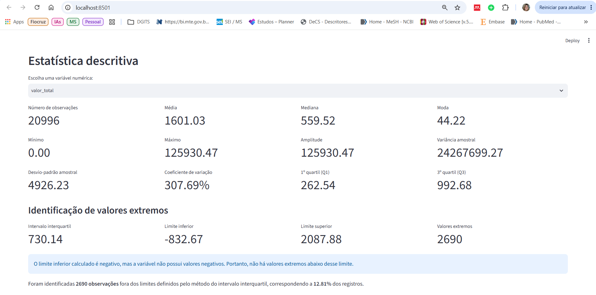
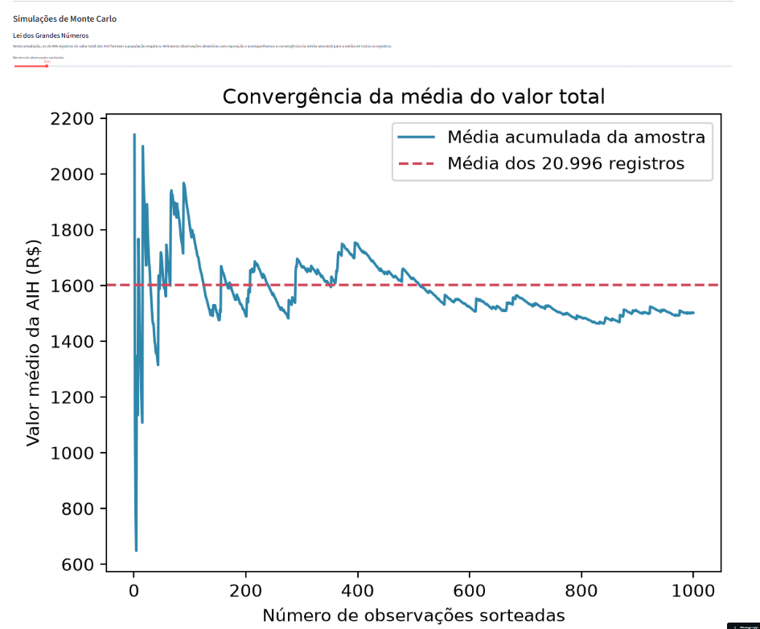
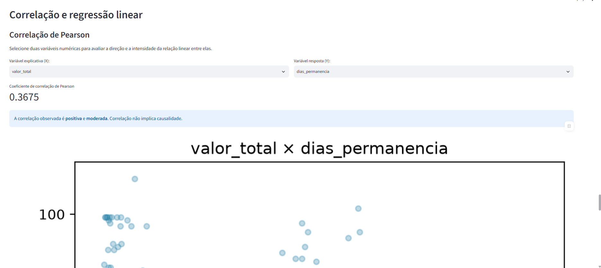

# LabSaúde SUS

Laboratório estatístico interativo desenvolvido em Python e Streamlit com dados públicos de internações hospitalares do Sistema Único de Saúde.

O projeto utiliza registros de Autorizações de Internação Hospitalar do Distrito Federal, referentes à competência janeiro de 2025.

## Aplicativo publicado

Acesse o laboratório estatístico interativo:

[https://labsaude-sus-estatistico.streamlit.app/](https://labsaude-sus-estatistico.streamlit.app/)

## Vídeo de apresentação

[Assista à demonstração do LabSaúde SUS](https://youtu.be/muM0GcLSFyM)

## Base de dados

- Fonte: Sistema de Informações Hospitalares do SUS — SIH/SUS
- Local: Distrito Federal
- Competência: janeiro de 2025
- Número de registros: 20.996 AIH
- Número de variáveis selecionadas: 13

Cada linha representa um registro de AIH, e não necessariamente uma pessoa única.

## Funcionalidades

O aplicativo apresenta:

- medidas descritivas calculadas por funções próprias;
- média, mediana, moda, amplitude, variância e desvio-padrão;
- percentis, quartis e coeficiente de variação;
- identificação de valores extremos pelo método do intervalo interquartil;
- tabelas de frequências;
- histogramas e boxplots;
- gráficos de barras e setores;
- interpretação automática das distribuições;
- simulação da Lei dos Grandes Números;
- demonstração do Teorema Central do Limite;
- distribuição Normal;
- distribuição Binomial;
- correlação de Pearson;
- regressão linear por mínimos quadrados;
- coeficiente de determinação;
- previsão interativa.

## Estrutura do projeto

```text
labsaude-estatistico/
├── app.py
├── minhastats.py
├── preparar_dados.py
├── test_minhastats.py
├── requirements.txt
├── README.md
├── RELATORIO.md
├── assets/
└── dados/
    ├── brutos/
    │   └── RDDF2501.dbc
    └── internacoes_sih_df_janeiro_2025.csv
    ```

## Imagens do aplicativo

### Estatística descritiva



### Simulações de Monte Carlo



### Correlação e regressão linear



## Biblioteca estatística própria

O arquivo `minhastats.py` contém implementações próprias de média, mediana, moda, amplitude, variância, desvio-padrão, percentis, quartis, coeficiente de variação, covariância, correlação de Pearson e regressão linear simples.

As funções foram verificadas por testes automatizados e comparadas, quando pertinente, com resultados do NumPy e do SciPy.

## Como executar

### 1. Clonar o repositório

```powershell
git clone https://github.com/anacarolinaestevess/labsaude-estatistico.git
cd labsaude-estatistico
```

### 2. Criar e ativar o ambiente virtual

```powershell
py -m venv .venv
Set-ExecutionPolicy -Scope Process -ExecutionPolicy RemoteSigned
.\.venv\Scripts\Activate.ps1
```

### 3. Instalar as dependências

```powershell
python -m pip install -r requirements.txt
```

### 4. Preparar os dados

```powershell
python preparar_dados.py
```

### 5. Executar os testes

```powershell
python -m pytest -v
```

### 6. Iniciar o aplicativo

```powershell
python -m streamlit run app.py
```

O aplicativo será disponibilizado em `http://localhost:8501`.

## Resultados principais

1. AIH com registro de óbito apresentaram maiores valores, maior permanência hospitalar e maior utilização de UTI.
2. AIH de alta complexidade apresentaram valor médio quase sete vezes maior que as de média complexidade.
3. Dias de permanência e valor total apresentaram correlação positiva moderada, embora a permanência explique apenas parte da variação dos valores.

Os resultados completos estão disponíveis em [RELATORIO.md](RELATORIO.md).

## Limitações

Os dados correspondem a uma única competência mensal e a uma unidade da Federação. Representam registros administrativos de AIH, e não pessoas únicas. Os resultados são descritivos e não permitem estabelecer relações causais.

## Tecnologias utilizadas

- Python
- Streamlit
- Pandas
- NumPy
- Matplotlib
- SciPy
- Pytest
- pyreaddbc
- dbfread

## Autora

Ana Carolina Esteves da Silva Pereira
