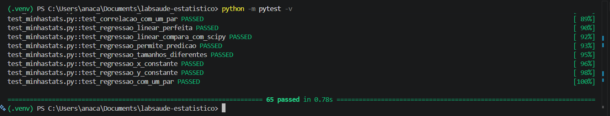
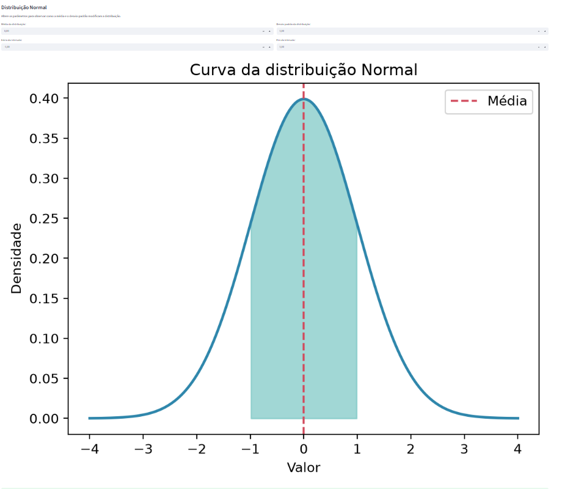

# Relatório do Laboratório Estatístico Interativo

## 1. Identificação

**Autora:** Ana Carolina Esteves da Silva Pereira
**Projeto:** LabSaúde SUS  
**Base de dados:** Sistema de Informações Hospitalares do SUS (SIH/SUS)  
**Recorte:** Distrito Federal, competência janeiro de 2025

## 2. Objetivo

Desenvolver um laboratório estatístico interativo em Python para aplicar conceitos de estatística descritiva, simulação de Monte Carlo, distribuições de probabilidade, correlação e regressão linear a dados públicos de saúde.

## 3. Base de dados

Foram utilizados dados públicos do Sistema de Informações Hospitalares do SUS, disponibilizados pelo DATASUS. O arquivo analisado contém registros de Autorizações de Internação Hospitalar do Distrito Federal referentes à competência janeiro de 2025.

A base original possuía 20.996 registros e 113 variáveis. Após o processamento, foram selecionadas 13 variáveis relevantes para o projeto:

- idade em anos;
- dias de permanência;
- quantidade de diárias;
- dias de UTI;
- valor total da AIH;
- valor de UTI;
- sexo;
- raça/cor;
- caráter da internação;
- diagnóstico principal;
- procedimento realizado;
- complexidade;
- ocorrência de óbito.

Cada linha representa um registro de AIH. Portanto, os dados não representam necessariamente pessoas únicas, pois uma mesma pessoa pode possuir mais de uma AIH.

## 4. Preparação dos dados

O arquivo original foi obtido no formato DBC. A conversão para DBF foi realizada com o pacote `pyreaddbc`, e a leitura foi feita com `dbfread` e `pandas`.

Foram selecionadas e renomeadas as variáveis utilizadas no projeto. A idade foi convertida para anos considerando o código da unidade de idade presente no SIH/SUS. As variáveis categóricas também receberam rótulos para facilitar sua interpretação.

A base processada possui 20.996 linhas, 13 colunas e não apresenta valores ausentes nas variáveis selecionadas.

## 5. Métodos estatísticos

Foi desenvolvido o módulo próprio `minhastats.py`, contendo implementações das seguintes medidas:

- média;
- mediana;
- moda;
- amplitude;
- variância populacional e amostral;
- desvio-padrão populacional e amostral;
- percentis;
- quartis;
- coeficiente de variação;
- covariância;
- correlação de Pearson;
- regressão linear simples por mínimos quadrados;
- coeficiente de determinação.

As funções foram verificadas por testes automatizados com `pytest` e comparadas, quando pertinente, com resultados do NumPy e do SciPy.

O aplicativo também apresenta tabelas de frequências, histogramas, boxplots, gráficos de barras e setores, além da identificação de valores extremos pelo método do intervalo interquartil.

Foram implementadas simulações da Lei dos Grandes Números e do Teorema Central do Limite por reamostragem, com reposição, dos valores totais das AIH.

Também foram incluídas aplicações interativas das distribuições Normal e Binomial.

### 5.1 Fórmulas implementadas no núcleo estatístico

As medidas exibidas pelo aplicativo são calculadas pelas funções próprias do arquivo `minhastats.py`.

#### Média aritmética

\[
\bar{x} = \frac{\sum_{i=1}^{n} x_i}{n}
\]

#### Variância populacional

\[
\sigma^2 = \frac{\sum_{i=1}^{n}(x_i-\bar{x})^2}{n}
\]

#### Variância amostral

\[
s^2 = \frac{\sum_{i=1}^{n}(x_i-\bar{x})^2}{n-1}
\]

#### Desvio-padrão

\[
s = \sqrt{s^2}
\]

#### Coeficiente de variação

\[
CV = \frac{s}{\bar{x}} \times 100
\]

#### Covariância amostral

\[
\operatorname{cov}(X,Y) =
\frac{\sum_{i=1}^{n}(x_i-\bar{x})(y_i-\bar{y})}{n-1}
\]

#### Correlação de Pearson

\[
r =
\frac{\operatorname{cov}(X,Y)}{s_Xs_Y}
\]

#### Regressão linear simples

\[
\hat{y} = b_0 + b_1x
\]

\[
b_1 =
\frac{\sum(x_i-\bar{x})(y_i-\bar{y})}
{\sum(x_i-\bar{x})^2}
\]

\[
b_0 = \bar{y} - b_1\bar{x}
\]

#### Coeficiente de determinação

\[
R^2 =
1 -
\frac{\sum(y_i-\hat{y}_i)^2}
{\sum(y_i-\bar{y})^2}
\]

Os percentis foram calculados pela posição \(p(n-1)/100\) no vetor ordenado, com interpolação linear entre os valores vizinhos.

### 5.2 Validação das funções

As implementações próprias foram verificadas por 65 testes automatizados. As bibliotecas NumPy e SciPy foram utilizadas apenas como referências nos testes, e não para calcular as medidas apresentadas pelo aplicativo.

| Função própria | Referência de validação | Diferença observada | Tolerância |
|---|---|---:|---:|
| Média | `numpy.mean` | Dentro da tolerância | \(10^{-9}\) |
| Mediana | `numpy.median` | Dentro da tolerância | \(10^{-9}\) |
| Moda | `scipy.stats.mode` e casos conhecidos | Resultado equivalente | Exata |
| Amplitude | `numpy.ptp` | Dentro da tolerância | \(10^{-9}\) |
| Variância populacional | `numpy.var(ddof=0)` | Dentro da tolerância | \(10^{-9}\) |
| Variância amostral | `numpy.var(ddof=1)` | Dentro da tolerância | \(10^{-9}\) |
| Desvio-padrão | `numpy.std` | Dentro da tolerância | \(10^{-9}\) |
| Percentis e quartis | `numpy.percentile` | Dentro da tolerância | \(10^{-6}\) |
| Covariância | `numpy.cov` | Dentro da tolerância | \(10^{-9}\) |
| Correlação de Pearson | `scipy.stats.pearsonr` | Dentro da tolerância | \(10^{-9}\) |
| Regressão linear | `scipy.stats.linregress` | Dentro da tolerância | \(10^{-9}\) |

### 5.3 Evidências dos módulos

#### Módulo 2 — Estatística descritiva

O módulo permite selecionar variáveis numéricas e categóricas, calcular medidas com o núcleo próprio, produzir tabelas de frequências e visualizar histogramas, boxplots e gráficos categóricos. Os valores extremos são identificados pelo método do intervalo interquartil.

#### Módulo 3 — Simulações de Monte Carlo

A Lei dos Grandes Números e o Teorema Central do Limite foram demonstrados por reamostragens, com reposição, do valor total das AIH. O tamanho das amostras e o número de repetições podem ser alterados pelo usuário.

#### Módulo 4 — Distribuições de probabilidade

A distribuição Normal foi sobreposta ao histograma dos dados utilizando média e desvio-padrão calculados pelas funções próprias. O aplicativo discute as limitações do ajuste quando os dados apresentam assimetria. Também foi implementada a distribuição Binomial para representar, de forma didática, o número de registros de óbito em uma quantidade fixa de AIH.

#### Módulo 5 — Correlação e regressão

O módulo calcula o coeficiente de Pearson, apresenta o diagrama de dispersão, ajusta a regressão linear por mínimos quadrados e exibe equação, \(R^2\) e previsão interativa. A previsão é limitada ao intervalo observado da variável explicativa para evitar extrapolação.

## 6. Principais descobertas

### 6.1 AIH com registro de óbito

As AIH com registro de óbito apresentaram maior utilização de recursos e maior permanência hospitalar.

O valor médio dessas AIH foi de R$ 5.062,24, aproximadamente 3,4 vezes o valor médio das AIH sem óbito, de R$ 1.490,10.

A permanência média foi de 12,44 dias nas AIH com óbito e de 5,62 dias naquelas sem óbito. O número médio de dias em UTI foi de 5,03 e 0,56, respectivamente.

Esses resultados representam associações descritivas e não permitem concluir que uma dessas características tenha causado as demais.

### 6.2 Complexidade e valor da AIH

As AIH de alta complexidade apresentaram valor médio de R$ 8.125,97, enquanto as de média complexidade apresentaram valor médio de R$ 1.172,13. Assim, o valor médio da alta complexidade foi quase sete vezes maior.

Apesar da diferença de custo, a permanência média foi semelhante: 5,09 dias na alta complexidade e 5,88 dias na média complexidade.

O uso médio de UTI foi de 1,29 dia na alta complexidade e de 0,66 dia na média complexidade. Os resultados sugerem que a diferença de valor não é explicada apenas pela permanência hospitalar, podendo estar relacionada à intensidade assistencial e aos procedimentos realizados.

### 6.3 Permanência e valor total

Foi observada correlação linear positiva moderada entre o número de dias de permanência e o valor total da AIH, com coeficiente de Pearson igual a 0,3675.

A regressão linear estimou um acréscimo médio de R$ 203,57 no valor total para cada dia adicional de permanência.

O coeficiente de determinação foi de 0,1351. Portanto, o modelo linear com dias de permanência explicou 13,51% da variação observada no valor total das AIH. Isso indica que outros fatores também possuem papel importante na determinação dos valores.

## 7. Limitações

A análise apresenta as seguintes limitações:

- utilização de apenas uma competência mensal e uma unidade da Federação;
- análise de registros de AIH, e não de pessoas únicas;
- possibilidade de erros ou diferenças de preenchimento nos dados administrativos;
- ausência de ajuste por diagnóstico, procedimento, gravidade e outras características clínicas;
- resultados descritivos, sem possibilidade de estabelecer relações causais;
- a regressão linear simples pode não representar integralmente relações assimétricas ou não lineares.

## 8. Conclusão

O projeto permitiu aplicar conceitos estatísticos a uma base pública real do SUS e demonstrou como ferramentas computacionais podem apoiar a exploração de dados hospitalares.

Os resultados mostraram diferenças importantes nos valores e na utilização de recursos segundo ocorrência de óbito e complexidade assistencial. Também mostraram que a permanência hospitalar possui associação positiva com o valor total, embora explique apenas parte de sua variação.

O aplicativo possibilita explorar as variáveis de forma interativa e visualizar conceitos estatísticos por meio de dados reais e simulações.